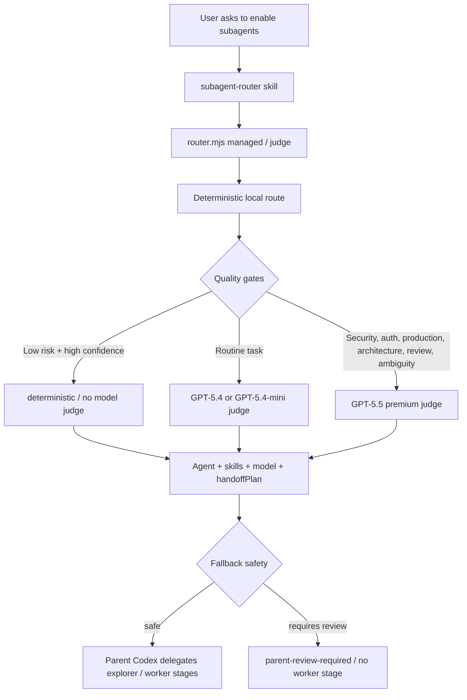

# Codex Subagent Router v13


Quality-first routing for Codex subagents. This repository packages a local router that selects VoltAgent agent identities, Codex skills, community skills, model tiers, recovery behavior, and multi-agent handoff plans for Codex workflows.

The goal is simple: when you explicitly ask Codex to use subagents, the parent Codex can automatically choose the right specialist, the right skills, the right sandbox, and the right model strength without blindly spending GPT-5.5 tokens on every task.

## Highlights

- 167 VoltAgent agent identities in the generated registry snapshot.
- 279 available skills detected in the tested environment.
- 74 imported community skills from curated GitHub skill sources.
- Quality-first model policy: GPT-5.5 for high-risk work, cheaper routing only for safe and obvious tasks.
- Structured routing output with `finalAgent`, `selectedSkills`, `selectedModel`, `reasoningEffort`, `executionPlan`, and `handoffPlan`.
- Explainable decisions through `decisionTrace`, `qualityGates`, `rejectedCandidates`, and `skillRationale`.
- Conservative fallback behavior through `failureClass`, `fallbackSafety`, `requiresParentReview`, `delegationBlocked`, and `approvalState`.
- v9 skill repair: configured local skills omitted by the initial candidate budget can be repaired without discarding an otherwise valid GPT-5.5 judgement.
- v10 orchestration routing: explicit broad multi-agent project work becomes staged, while vague broad work still clarifies first.
- v11 managed delegation: one-line requests such as "调用合适子代理完成任务" produce a concise user-facing stage/goal plan without exposing internal routing fields.
- v12 task kinds: `release-publishing`, `repo-maintenance`, `research-only`, and `incident-response` improve README/release, maintenance, no-write research, and production incident routing.
- v12 managed contracts: `managed --json` now includes `executionContract`, `writeBoundaries`, `parentResponsibilities`, `stageInputs`, and `stageOutputs`.
- v12 config governance: taskKind, risk, cache, model, and managed UX policy are validated by `config-check` and explainable through `config-explain`.
- v12 speed work: persistent route cache, route-cache statistics, `refresh-skills`, snapshot staleness checks, and cold/warm performance benchmarks reduce repeated local prep.
- v13 agent roster: every route can expose primary, mapper, implementer, validator, reviewer, fallback candidates, and preferred-agent fallback warnings.
- v13 managed readiness: `managed --json` adds `delegationReadiness`, `nextAction`, and `stageSkillLoadingOrder` so the parent Codex can move directly into the next safe stage.
- v13 eval governance: deterministic eval expanded to 112 cases with taskKind bucket pass-rate reporting.
- v13 cache maintenance: `cache-status` and `cache-prune` make judgement/route cache health visible and cleanable.
- Built-in eval, performance, managed UX, managed-contract, config, route-cache, skills-phase, judge-matrix, recovery, handoff, skill-repair, doctor, and report commands.

## How It Works



The router combines four sources of truth:

- `subagents/registry.json`: VoltAgent agent metadata.
- `subagents/strategy-config.json`: intent, taskKind, skill, cost, cache, model-risk, managed UX, agent roster, and candidate-budget policy.
- `subagents/community-skills-manifest.json`: imported community skills.
- Local Codex skill discovery from `~/.codex/skills`, `~/.agents/skills`, and plugin caches.

## Parent Codex Boundary

The router does not execute work by itself. It returns a routing decision for the parent Codex: which agent identity to use, which skills to load, which model and reasoning effort to request, and which handoff stages are safe. The parent Codex remains responsible for loading the relevant skill instructions, spawning any subagent, integrating the result, protecting unrelated user changes, and running final verification before reporting completion.

Selected skills are execution guidance, not automatic actions. They do not override system, developer, user, AGENTS.md, sandbox, approval, or final-review requirements.

## Clarify-First Behavior

Explicitly asking for subagents enables routing, but it does not remove ambiguity checks. If the route has low confidence, needs parent choice, requires user clarification, is delegation-blocked, or returns `parent-review-required`, the parent Codex should ask one concise clarification question or manually review the fallback before spawning a worker.

Broad requests are split into two cases:

- Authorized broad work, such as "use multiple agents and skills to fully optimize this project", becomes a `staged` plan with explore, analyze or implement, validate, and review stages.
- Vague broad work, such as "use multiple agents to optimize this", remains `clarify-first` until the goal, files, risk boundary, or acceptance criteria are clear.

## Routing Modes

| Mode | Judge model | Intended use |
| --- | --- | --- |
| `deterministic` | none | Low-risk, high-confidence, stable tasks. |
| `mini-judge` | GPT-5.4-mini | Economy budget for routine safe tasks. |
| `standard-judge` | GPT-5.4 | Balanced default for normal tasks. |
| `premium-judge` | GPT-5.5 | Security, auth, privacy, production, architecture, migration, review, ambiguity, and high-risk work. |

The delegated subagent model is selected separately from the routing judge. A cheap judge does not automatically mean a cheap execution model.

## Repository Contents

- `subagents/router.mjs`: main router CLI.
- `subagents/strategy-config.json`: routing strategy and cost policy.
- `subagents/judgement.schema.json`: structured model judgement schema.
- `subagents/community-skills-manifest.json`: imported community skill manifest.
- `subagents/registry.json`: VoltAgent agent registry snapshot.
- `subagents/import-community-skills.mjs`: community skill importer.
- `~/.codex/subagents/skill-registry-snapshot.json`: local runtime snapshot used to avoid repeated plugin-cache scans.
- `skills/subagent-router/SKILL.md`: Codex global skill instructions.
- `outputs/`: implementation plans and verification reports.
- `assets/`: README visual assets.

## Install Into Codex

From this repository root:

```bash
mkdir -p ~/.codex/subagents ~/.codex/skills/subagent-router
cp subagents/router.mjs ~/.codex/subagents/router.mjs
cp subagents/strategy-config.json ~/.codex/subagents/strategy-config.json
cp subagents/judgement.schema.json ~/.codex/subagents/judgement.schema.json
cp subagents/community-skills-manifest.json ~/.codex/subagents/community-skills-manifest.json
cp subagents/registry.json ~/.codex/subagents/registry.json
cp skills/subagent-router/SKILL.md ~/.codex/skills/subagent-router/SKILL.md
chmod +x ~/.codex/subagents/router.mjs
```

## Basic Usage

Run a deterministic route:

```bash
node subagents/router.mjs route --json "开启子代理，帮我修前端 bug"
```

Run the cost-aware judge:

```bash
node subagents/router.mjs judge --json "开启子代理，修复 API 鉴权问题"
```

Run managed delegation for a normal user request:

```bash
node subagents/router.mjs managed --json "开启子代理，调用合适子代理，用 goal 模式持续实现"
```

Show a human-readable explanation:

```bash
node subagents/router.mjs judge --explain "开启子代理，审查当前 diff"
```

Explain which v12 config policies match a task:

```bash
node subagents/router.mjs config-explain "开启子代理，根据生产日志处理线上事故并准备回滚"
```

Inspect cache health and prune stale local cache entries:

```bash
node subagents/router.mjs cache-status
node subagents/router.mjs cache-prune --all --older-than-hours 168
```

Use budget controls:

```bash
node subagents/router.mjs judge --json --budget economy "开启子代理，补齐 pytest 覆盖率"
node subagents/router.mjs judge --json --budget premium "开启子代理，审查生产鉴权风险"
```

## Verification

```bash
node --check subagents/router.mjs
node subagents/router.mjs test
node subagents/router.mjs eval
node subagents/router.mjs test-performance
node subagents/router.mjs test-managed
node subagents/router.mjs test-managed-contract
node subagents/router.mjs test-skills-phase
node subagents/router.mjs test-judge-matrix
node subagents/router.mjs test-recovery
node subagents/router.mjs test-handoff
node subagents/router.mjs test-skill-repair
node subagents/router.mjs test-config
node subagents/router.mjs test-config-explain
node subagents/router.mjs test-route-cache
node subagents/router.mjs test-agent-roster
node subagents/router.mjs test-managed-readiness
node subagents/router.mjs test-cache-maintenance
node subagents/router.mjs doctor
node subagents/router.mjs report
```

For the live GPT-5.5 smoke test, use the installed path so local Codex CLI paths match the environment:

```bash
~/.codex/subagents/router.mjs test-judge
```

## Current v13 Result

The final v13 verification passed:

- 16/16 regression tests.
- 112/112 eval cases across 8 taskKind buckets.
- Performance test passed: compact prompt is about 49% smaller than the v10-style estimate; default JSON is about 88% smaller than verbose JSON.
- Managed delegation and managed-contract tests passed: authorized goal requests produce staged plans; high-risk write tasks include validation/review; managed JSON includes stage inputs/outputs and write boundaries without exposing internal budgets.
- Managed readiness tests passed: ready requests return `nextAction.type = "spawn"`, vague requests return one clarification, and blocked high-risk fallbacks return parent review.
- Agent roster tests passed: routes expose primary/mapper/implementer/validator/reviewer and explain missing preferred-agent fallbacks.
- Config tests passed: taskKind policy, high-risk GPT-5.5 rules, configured skills, `config-check`, and `config-explain` are valid.
- Route-cache and cache-maintenance tests passed: stable low/medium-risk tasks can hit persistent cache; volatile current diff/log/incident/security tasks bypass cache; stale local cache can be pruned.
- Skills-phase and judge-matrix tests passed.
- Recovery tests passed.
- Handoff tests passed.
- Skill-repair tests passed.
- Doctor/report passed.
- `refresh-skills` rebuilt the local skill snapshot with 279 skills in the tested environment.
- Explicit multi-agent project optimization now routes to `staged` instead of over-clarifying.
- Vague multi-agent project optimization still routes to `clarify-first`.
- Generic "agent/智能体" wording no longer pulls OpenAI/LangGraph skills unless those technologies are explicitly named.
- GPT-5.5 critical routing smoke test passed for high-risk current diff auth review.

See [`outputs/subagent-router-v13-final-report.md`](outputs/subagent-router-v13-final-report.md) for the full report.

## v13 Reliability and UX Changes

- `agentRoster` explains the usable agent lineup for the task: primary, mapper, implementer, validator, reviewer, fallbacks, and missing preferred-agent fallbacks.
- `managed --json` now includes `delegationReadiness`, `nextAction`, and `stageSkillLoadingOrder`.
- Route cache keys include an internal router metadata version so code-level routing changes do not accidentally reuse stale cache entries.
- Release-publishing tasks preserve GitHub repository skills when README, release, public repo, or publishing language appears.
- Orchestration-design tasks preserve planning skills and treat managed-contract/stage-skill-loading work as strong orchestration signals.
- Public hygiene/security review tasks that do not ask for edits stay read-only.
- `eval` now records taskKind bucket stats in `last-eval-results.json`.
- Added `cache-status`, `cache-prune`, `test-agent-roster`, `test-managed-readiness`, and `test-cache-maintenance`.

## v12 Reliability and UX Changes

- Added `release-publishing`, `repo-maintenance`, `research-only`, and `incident-response` taskKinds.
- README/release/documentation publishing is no longer treated as DevOps just because GitHub or changelog terms appear.
- `research-only` and explicit no-write tasks are forced into read-only agent/sandbox behavior and do not generate implementation stages.
- Production incidents, production logs, rollback, outage, security, auth, and current diff stay on GPT-5.5 and bypass stale caches when volatile.
- `managed --json` includes an execution contract with write boundaries, parent responsibilities, and stage input/output expectations.
- Strategy config v12 validates taskKind policy, allowed phases, high-risk coverage, and configured skill existence.
- `config-check`, `config-explain`, `test-config`, `test-config-explain`, `test-route-cache`, and `test-managed-contract` were added.
- Persistent route cache records hit rate, bypass reasons, oldest/newest entries, and quarantine count.
- `refresh-skills` rebuilds the local skill registry snapshot.

## v11 Reliability and UX Changes

- Added `taskKind` semantic routing for engineering execution, engineering analysis, product analysis, and orchestration design.
- Product-analysis tasks do not generate implementation stages or debugging skills by default.
- Orchestration-design tasks prefer architecture/coordinator agents and staged map, failure-analysis, implementation, validation, and review handoffs.
- Low-risk read-only product/docs/planning routes avoid unnecessary GPT-5.5 judges; high-risk security, auth, production, current diff, and complex orchestration keep GPT-5.5.
- Default `judge --json` is compact; use `judge --verbose` or `judge --explain` for full internals.
- `managed --json` is the preferred user-facing delegation output for ordinary "call suitable subagents" requests.
- Skill registry snapshot and route cache reduce repeated local discovery work.

## v9-v10 Reliability Changes

- Candidate skills from strong strategy rules are protected from truncation by the initial skill budget.
- If GPT-5.5 selects a configured, locally available skill that was outside the initial candidate list, the router repairs it, emits `routingWarnings`, and keeps the rest of the judgement.
- Unknown skills and non-candidate agents still fail safely.
- `selectedSkillsByPhase` is rebuilt from final `selectedSkills`, so handoff stages cannot receive unselected skills.
- High-risk fallback results use `parent-review-required` mode and do not include executable `primary` or `implement` stages.
- Workflow skills are phase-aware: plan writing stays in planning, plan execution is available to implementation, and test/review guidance stays in the matching stage.
- Repository-local config, schema, registry, and manifest files are used when running from a clone; runtime cache still lives under `~/.codex/subagents`.

## Cache and Local Data

The judgement cache is stored at `~/.codex/subagents/judgement-cache.json`. It stores model judgement results keyed by a hash of the task and candidate packet. The route cache is stored at `~/.codex/subagents/route-cache.json`. It stores stable deterministic route preparation for non-volatile low/medium-risk tasks. Volatile tasks such as current diffs, logs, stack traces, incidents, file/line-specific failures, and test output bypass cache automatically.

To clear local router state:

```bash
rm -f ~/.codex/subagents/judgement-cache.json
rm -f ~/.codex/subagents/route-cache.json
rm -f ~/.codex/subagents/skill-registry-snapshot.json
rm -f ~/.codex/subagents/last-eval-results.json
rm -f ~/.codex/subagents/last-skill-repair-results.json
```

Refresh the skill snapshot without clearing other state:

```bash
node subagents/router.mjs refresh-skills
```

## Upstream Projects and Acknowledgements

This repository is an integration and routing layer. It exists because several excellent open-source projects made agent identities and skill instructions reusable:

| Project | Used for | Notes |
| --- | --- | --- |
| [VoltAgent/awesome-codex-subagents](https://github.com/VoltAgent/awesome-codex-subagents) | Agent identity source | The generated `subagents/registry.json` is built from VoltAgent-style Codex subagent identities. These identities provide the specialist roles and working methods that this router selects from. |
| [openai/skills](https://github.com/openai/skills) | Community skill source | Imported skills for official-style workflows such as Figma, Notion, Linear, ASP.NET Core, speech, transcription, and security ownership mapping. |
| [kid-sid/codex-spellbook](https://github.com/kid-sid/codex-spellbook) | Community skill source | Imported broad engineering skills for API design, React, backend frameworks, databases, Docker, CI/CD, cloud, security, observability, and testing. |
| [mattpocock/skills](https://github.com/mattpocock/skills) | Community skill source | Imported high-signal engineering workflow skills such as TDD, diagnosis, PRD/issues conversion, architecture improvement, and prototyping. |
| [jMerta/codex-skills](https://github.com/jMerta/codex-skills) | Community skill source | Imported workflow-oriented skills for AGENTS.md, CI fixes, coding guidelines, docs sync, dependency upgrades, release notes, planning, and triage. |

Thank you to the maintainers and contributors of these projects. This router adds selection, cost policy, quality gates, recovery behavior, evals, and handoff planning on top of their work; it does not claim authorship of the upstream agent or skill content.

The imported sources are tracked in [`subagents/community-skills-manifest.json`](subagents/community-skills-manifest.json), including source labels and repository URLs where available. See [`NOTICE.md`](NOTICE.md) for the third-party attribution summary.

## Attribution and License Notes

Before redistributing, republishing, or using this repository in a product, review the licenses and attribution requirements of each upstream project listed above. This repository is a snapshot and integration layer, so upstream licenses may apply to the agent and skill content copied or indexed here.

## Notes

This repository is a portable snapshot of a local Codex setup. Some commands, especially live judgement and skill discovery, depend on the target machine's Codex installation, available models, plugin cache, and local skills.

High-risk work is intentionally conservative. If a model judge fails for high-risk tasks, the router marks the result as requiring parent review instead of silently treating a fallback as safe.
