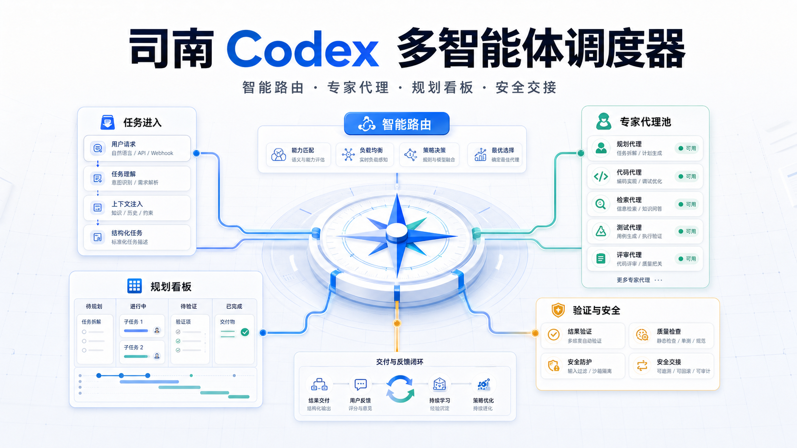
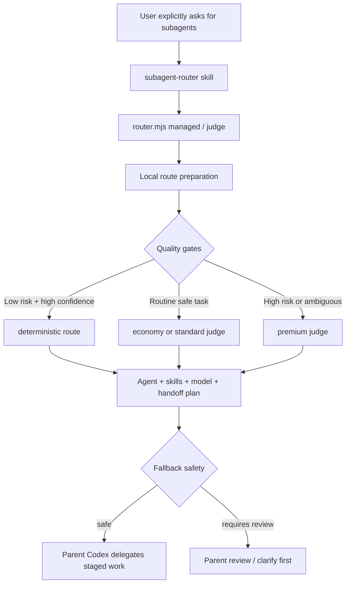

# 司南 Codex 多智能体调度器



司南 Codex 多智能体调度器是一个质量优先的本地 Codex 子代理路由器，帮助父级 Codex 为明确的多智能体任务选择合适的代理身份、技能、模型强度、沙箱边界、规划看板和安全交接路径。

它适合需要在复杂代码库中进行分工、验证和持续迭代的用户：普通低风险任务保持轻量快速；安全、鉴权、生产、架构、迁移、审查、模糊范围和当前 diff 相关任务保持保守。

## What It Does

- Selects from VoltAgent-style agent identities and bundled Agency prompt-pack specialists.
- Matches each task to relevant Codex skills, community skills, model tier, and reasoning effort.
- Returns structured routing data for `finalAgent`, `selectedSkills`, `selectedModel`, `executionPlan`, `handoffPlan`, `qualityGates`, and fallback state.
- Produces managed delegation output for the parent Codex, including a planning brief, agent work cards, batch plan, handoff contracts, verification board, write boundaries, stage inputs/outputs, parent responsibilities, and next safe action.
- Renders an App-friendly Chinese `displayBoard` so Codex can show a readable stage board, safety panel, and Mermaid flow instead of raw JSON.
- Adds `openSourcePatterns`, a compact design-hint layer inspired by LangGraph Supervisor, CrewAI, AutoGen, and OpenAI Agents/Swarm patterns: agent-task-process separation, guarded handoffs, context control, supervisor review, parallel batch join, read-only sandboxing, and trace planning.
- Keeps provider prompts compact by default, with explicit hydration modes when a self-contained prompt is needed.
- Fails safely when a route is ambiguous, high-risk, blocked, or requires parent review.

## Quick Start

Run a managed route for an ordinary user request:

```bash
node subagents/router.mjs managed --json --profile compact "开启子代理，调用合适子代理完成这个任务"
```

Inspect context cost before dispatch:

```bash
node subagents/router.mjs inspect-context "开启子代理，帮我做 Reddit 社区增长策略"
```

Hydrate a provider prompt only when needed:

```bash
node subagents/router.mjs prompt agency:reddit-community-builder "帮我做 Reddit 社区增长策略" --hydrate summary --budget 2000
```

Ask for a human-readable explanation:

```bash
node subagents/router.mjs judge --explain "开启子代理，审查当前 diff"
```

Render the Codex App planning board:

```bash
node subagents/router.mjs managed --profile app "使用多智能体分批测试这个项目，输出规划看板"
```

The App board shows the user-facing result as Chinese Markdown:

```text
# 司南规划结果

| 阶段 | Agent | 状态 | 验收点 | 下一触发 |
| --- | --- | --- | --- | --- |
| 阶段 1: map | code-mapper | 可安全执行 | 记录范围和证据 | 完成后进入验证 |

安全边界会单独列出可安全执行项、阻塞项和是否需要父级 Codex 复核。
```

## How It Works



The router combines these sources:

- `subagents/registry.json`: VoltAgent agent registry snapshot.
- `subagents/agency-agents/`: bundled Agency provider catalog, compact agent-card index, and prompt bodies.
- `subagents/strategy-config.json`: task kind, risk, skill, cache, model, managed UX, roster, and candidate-budget policy.
- `subagents/community-skills-manifest.json`: imported community skill manifest.
- Local Codex skill discovery from `~/.codex/skills`, `~/.agents/skills`, and plugin caches.

## Parent Codex Boundary

The router does not execute the work. It returns a route for the parent Codex to apply: which identity to use, which skills to load, which model and reasoning effort to request, and which stages are safe to delegate.

The parent Codex remains responsible for loading skill instructions, spawning or bridging any subagent, protecting unrelated user changes, integrating results, and running final verification before reporting completion.

Native custom-name spawning depends on the current Codex host. When direct spawning by a provider identity is unavailable, `managed --json` exposes an `executionAdapter` and can fall back to a generic explorer or worker bridge. The selected provider identity is preserved through the generated `delegationPrompt`; only the transport layer changes.

Agency agents are used as role and methodology guidance. They do not override Codex system, developer, user, AGENTS.md, sandbox, approval, or verification rules. Full provider prompt hydration is explicit and should be reserved for debugging, isolated execution, or self-contained handoff needs.

## Clarify-First Behavior

Explicitly asking for subagents enables routing, but it does not remove ambiguity checks. If the route has low confidence, needs parent choice, requires user clarification, is delegation-blocked, or returns `parent-review-required`, the parent Codex should ask one concise clarification question or review the fallback before spawning a worker.

Broad requests are handled conservatively:

- Authorized broad work, such as "use multiple agents and skills to fully optimize this project", becomes a staged plan with discovery, implementation or analysis, validation, and review.
- Vague broad work, such as "use multiple agents to optimize this", remains clarify-first until the goal, files, risk boundary, or acceptance criteria are clear.

## Routing Modes

| Mode | Judge model | Intended use |
| --- | --- | --- |
| `deterministic` | none | Low-risk, high-confidence, stable tasks. |
| `mini-judge` | GPT-5.4-mini | Economy path for routine safe tasks. |
| `standard-judge` | GPT-5.4 | Balanced default for normal tasks. |
| `premium-judge` | GPT-5.5 | Security, auth, privacy, production, architecture, migration, review, ambiguity, and high-risk work. |

The delegated subagent model is selected separately from the routing judge. A cheap judge does not automatically mean a cheap execution model.

## Repository Contents

- `subagents/router.mjs`: main router CLI.
- `subagents/strategy-config.json`: routing strategy and cost policy.
- `subagents/judgement.schema.json`: structured model judgement schema.
- `subagents/community-skills-manifest.json`: imported community skill manifest.
- `subagents/registry.json`: VoltAgent agent registry snapshot.
- `subagents/agency-agents/`: bundled Agency provider catalog and prompt bodies.
- `subagents/import-community-skills.mjs`: community skill importer.
- `plugins/codex-subagent-router/`: personal Codex plugin package.
- `skills/subagent-router/SKILL.md`: Codex skill instructions.
- `outputs/`: implementation plans and verification reports.
- `assets/`: README visual assets.

## Install Into Codex

From this repository root:

```bash
mkdir -p ~/.codex/subagents ~/.codex/skills/subagent-router
cp subagents/router.mjs ~/.codex/subagents/router.mjs
cp subagents/strategy-config.json ~/.codex/subagents/strategy-config.json
cp subagents/judgement.schema.json ~/.codex/subagents/judgement.schema.json
cp subagents/community-skills-manifest.json ~/.codex/subagents/community-skills-manifest.json
cp subagents/registry.json ~/.codex/subagents/registry.json
rm -rf ~/.codex/subagents/agency-agents
cp -R subagents/agency-agents ~/.codex/subagents/agency-agents
cp skills/subagent-router/SKILL.md ~/.codex/skills/subagent-router/SKILL.md
chmod +x ~/.codex/subagents/router.mjs
```

## Install As A Codex Plugin

This repository also includes a local personal plugin package at `plugins/codex-subagent-router/`.

```bash
mkdir -p ~/plugins
rm -rf ~/plugins/codex-subagent-router
cp -R plugins/codex-subagent-router ~/plugins/codex-subagent-router
python3 ~/.codex/skills/.system/plugin-creator/scripts/validate_plugin.py ~/plugins/codex-subagent-router
python3 ~/.codex/skills/.system/plugin-creator/scripts/update_plugin_cachebuster.py ~/plugins/codex-subagent-router
codex plugin add codex-subagent-router@personal
```

After installing, start a new Codex thread and try:

```text
开启子代理，调用合适 agent 完成任务
```

## Common Commands

```bash
node subagents/router.mjs route --json "开启子代理，帮我修前端 bug"
node subagents/router.mjs judge --json "开启子代理，修复 API 鉴权问题"
node subagents/router.mjs managed --json --profile compact "开启子代理，调用合适子代理，用 goal 模式持续实现"
node subagents/router.mjs managed --profile app "开启子代理，调用合适子代理，用 goal 模式持续实现"
node subagents/router.mjs config-explain "开启子代理，根据生产日志处理线上事故并准备回滚"
node subagents/router.mjs architecture-health
node subagents/router.mjs cache-status
node subagents/router.mjs cache-prune --all --older-than-hours 168
node subagents/router.mjs judge --json --budget economy "开启子代理，补齐 pytest 覆盖率"
node subagents/router.mjs judge --json --budget premium "开启子代理，审查生产鉴权风险"
```

## Verification

```bash
node --check subagents/router.mjs
node --check subagents/import-community-skills.mjs
node subagents/router.mjs test
node subagents/router.mjs eval
node subagents/router.mjs test-architecture
node subagents/router.mjs test-open-source-patterns
node subagents/router.mjs doctor
node subagents/router.mjs report
```

Additional targeted checks are available for managed delegation, execution adapters, provider routing, prompt hydration, context budgets, cache behavior, recovery, handoff, skill repair, and config governance.

For a live judge smoke test, use the installed path so local Codex CLI paths match the target environment:

```bash
~/.codex/subagents/router.mjs test-judge
```

## Reports

Detailed implementation notes, plans, and verification runs live in [`outputs/`](outputs/). The README intentionally stays focused on what the project is, how to use it, and where the safety boundaries are.

Useful reports:

- [`outputs/subagent-router-v17-contract-boundary-report.md`](outputs/subagent-router-v17-contract-boundary-report.md)
- [`outputs/subagent-router-v16-context-efficiency-final-report.md`](outputs/subagent-router-v16-context-efficiency-final-report.md)
- [`outputs/architecture-audit-optimization-report.md`](outputs/architecture-audit-optimization-report.md)
- [`outputs/open-source-patterns-integration-report.md`](outputs/open-source-patterns-integration-report.md)
- [`outputs/subagent-router-v15-agency-agents-final-report.md`](outputs/subagent-router-v15-agency-agents-final-report.md)
- [`outputs/subagent-router-v14-execution-adapter-report.md`](outputs/subagent-router-v14-execution-adapter-report.md)
- [`outputs/subagent-router-plugin-report.md`](outputs/subagent-router-plugin-report.md)

## Cache and Local Data

The judgement cache is stored at `~/.codex/subagents/judgement-cache.json`. The route cache is stored at `~/.codex/subagents/route-cache.json`. Stable low- and medium-risk tasks can use cache; volatile tasks such as current diffs, logs, stack traces, incidents, file-specific failures, and test output bypass cache automatically.

To clear local router state:

```bash
rm -f ~/.codex/subagents/judgement-cache.json
rm -f ~/.codex/subagents/route-cache.json
rm -f ~/.codex/subagents/skill-registry-snapshot.json
rm -f ~/.codex/subagents/last-eval-results.json
rm -f ~/.codex/subagents/last-skill-repair-results.json
```

Refresh the skill snapshot without clearing other state:

```bash
node subagents/router.mjs refresh-skills
```

## Upstream Projects and Acknowledgements

This repository is an integration and routing layer. It exists because several open-source projects made agent identities and skill instructions reusable:

| Project | Used for |
| --- | --- |
| [VoltAgent/awesome-codex-subagents](https://github.com/VoltAgent/awesome-codex-subagents) | VoltAgent-style Codex agent identities. |
| [msitarzewski/agency-agents](https://github.com/msitarzewski/agency-agents) | Bundled Agency prompt-pack specialists. |
| [openai/skills](https://github.com/openai/skills) | Imported community skill source. |
| [kid-sid/codex-spellbook](https://github.com/kid-sid/codex-spellbook) | Imported engineering skill source. |
| [mattpocock/skills](https://github.com/mattpocock/skills) | Imported engineering workflow skill source. |
| [jMerta/codex-skills](https://github.com/jMerta/codex-skills) | Imported workflow skill source. |

Thank you to the maintainers and contributors of these projects. This router adds selection, cost policy, quality gates, recovery behavior, evals, and handoff planning on top of their work; it does not claim authorship of upstream agent or skill content.

Imported sources are tracked in [`subagents/community-skills-manifest.json`](subagents/community-skills-manifest.json). See [`NOTICE.md`](NOTICE.md) for third-party attribution.

## License Notes

Before redistributing, republishing, or using this repository in a product, review the licenses and attribution requirements of each upstream project listed above. This repository is a snapshot and integration layer, so upstream licenses may apply to agent and skill content copied or indexed here.

## Notes

This repository is a portable snapshot of a local Codex setup. Some commands, especially live judgement and skill discovery, depend on the target machine's Codex installation, available models, plugin cache, and local skills.

High-risk work is intentionally conservative. If a model judge fails for a high-risk task, the router marks the result as requiring parent review instead of silently treating a fallback as safe.
