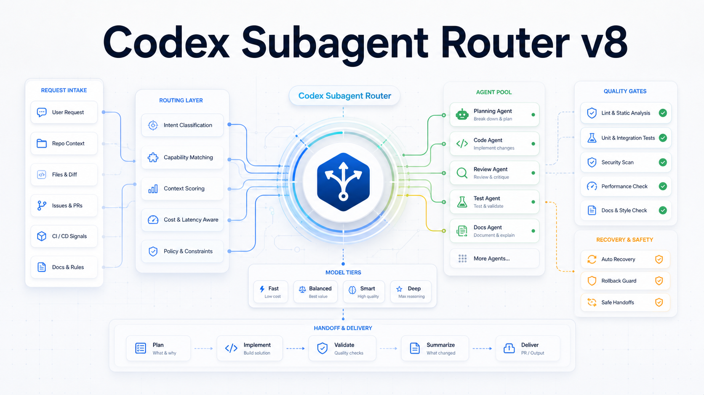
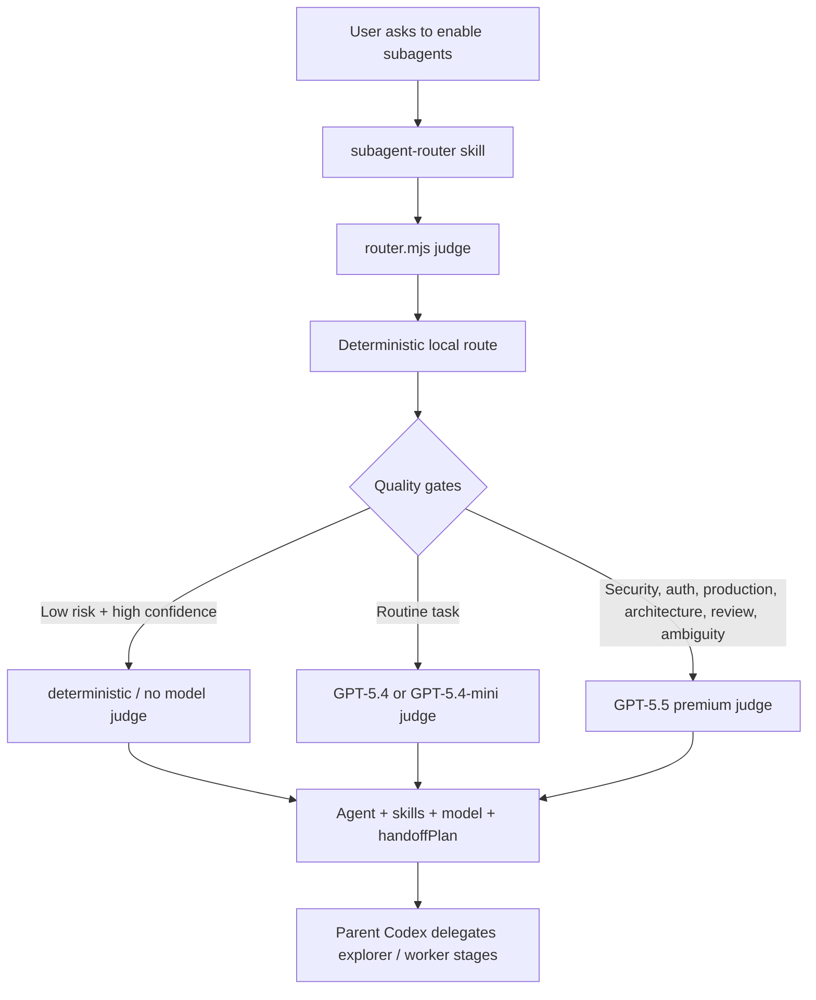

# Codex Subagent Router v8



Quality-first routing for Codex subagents. This repository packages a local router that selects VoltAgent agent identities, Codex skills, community skills, model tiers, recovery behavior, and multi-agent handoff plans for Codex workflows.

The goal is simple: when you explicitly ask Codex to use subagents, the parent Codex can automatically choose the right specialist, the right skills, the right sandbox, and the right model strength without blindly spending GPT-5.5 tokens on every task.

## Highlights

- 167 VoltAgent agent identities in the generated registry snapshot.
- 279 available skills detected in the tested environment.
- 74 imported community skills from curated GitHub skill sources.
- Quality-first model policy: GPT-5.5 for high-risk work, cheaper routing only for safe and obvious tasks.
- Structured routing output with `finalAgent`, `selectedSkills`, `selectedModel`, `reasoningEffort`, `executionPlan`, and `handoffPlan`.
- Explainable decisions through `decisionTrace`, `qualityGates`, `rejectedCandidates`, and `skillRationale`.
- Conservative fallback behavior through `failureClass`, `fallbackSafety`, and `requiresParentReview`.
- Built-in eval, recovery, handoff, doctor, and report commands.

## How It Works



The router combines four sources of truth:

- `subagents/registry.json`: VoltAgent agent metadata.
- `subagents/strategy-config.json`: intent, skill, cost, cache, and candidate-budget policy.
- `subagents/community-skills-manifest.json`: imported community skills.
- Local Codex skill discovery from `~/.codex/skills`, `~/.agents/skills`, and plugin caches.

## Routing Modes

| Mode | Judge model | Intended use |
| --- | --- | --- |
| `deterministic` | none | Low-risk, high-confidence, stable tasks. |
| `mini-judge` | GPT-5.4-mini | Economy budget for routine safe tasks. |
| `standard-judge` | GPT-5.4 | Balanced default for normal tasks. |
| `premium-judge` | GPT-5.5 | Security, auth, privacy, production, architecture, migration, review, ambiguity, and high-risk work. |

The delegated subagent model is selected separately from the routing judge. A cheap judge does not automatically mean a cheap execution model.

## Repository Contents

- `subagents/router.mjs`: main router CLI.
- `subagents/strategy-config.json`: routing strategy and cost policy.
- `subagents/judgement.schema.json`: structured model judgement schema.
- `subagents/community-skills-manifest.json`: imported community skill manifest.
- `subagents/registry.json`: VoltAgent agent registry snapshot.
- `subagents/import-community-skills.mjs`: community skill importer.
- `skills/subagent-router/SKILL.md`: Codex global skill instructions.
- `outputs/`: implementation plans and verification reports.
- `assets/`: README visual assets.

## Install Into Codex

From this repository root:

```bash
mkdir -p ~/.codex/subagents ~/.codex/skills/subagent-router
cp subagents/router.mjs ~/.codex/subagents/router.mjs
cp subagents/strategy-config.json ~/.codex/subagents/strategy-config.json
cp subagents/judgement.schema.json ~/.codex/subagents/judgement.schema.json
cp subagents/community-skills-manifest.json ~/.codex/subagents/community-skills-manifest.json
cp subagents/registry.json ~/.codex/subagents/registry.json
cp skills/subagent-router/SKILL.md ~/.codex/skills/subagent-router/SKILL.md
chmod +x ~/.codex/subagents/router.mjs
```

## Basic Usage

Run a deterministic route:

```bash
node subagents/router.mjs route --json "开启子代理，帮我修前端 bug"
```

Run the cost-aware judge:

```bash
node subagents/router.mjs judge --json "开启子代理，修复 API 鉴权问题"
```

Show a human-readable explanation:

```bash
node subagents/router.mjs judge --explain "开启子代理，审查当前 diff"
```

Use budget controls:

```bash
node subagents/router.mjs judge --json --budget economy "开启子代理，补齐 pytest 覆盖率"
node subagents/router.mjs judge --json --budget premium "开启子代理，审查生产鉴权风险"
```

## Verification

```bash
node --check subagents/router.mjs
node subagents/router.mjs test
node subagents/router.mjs eval
node subagents/router.mjs test-recovery
node subagents/router.mjs test-handoff
node subagents/router.mjs doctor
node subagents/router.mjs report
```

For the live GPT-5.5 smoke test, use the installed path so local Codex CLI paths match the environment:

```bash
~/.codex/subagents/router.mjs test-judge
```

## Current v8 Result

The final v8 verification passed:

- 16/16 regression tests.
- 52/52 eval cases.
- Recovery tests passed.
- Handoff tests passed.
- Doctor/report passed.
- Economy, balanced, premium, and critical budget matrix passed.
- GPT-5.5 quality-gate smoke test passed.

See [`outputs/subagent-router-v8-final-report.md`](outputs/subagent-router-v8-final-report.md) for the full report.

## Notes

This repository is a portable snapshot of a local Codex setup. Some commands, especially live judgement and skill discovery, depend on the target machine's Codex installation, available models, plugin cache, and local skills.

High-risk work is intentionally conservative. If a model judge fails for high-risk tasks, the router marks the result as requiring parent review instead of silently treating a fallback as safe.
